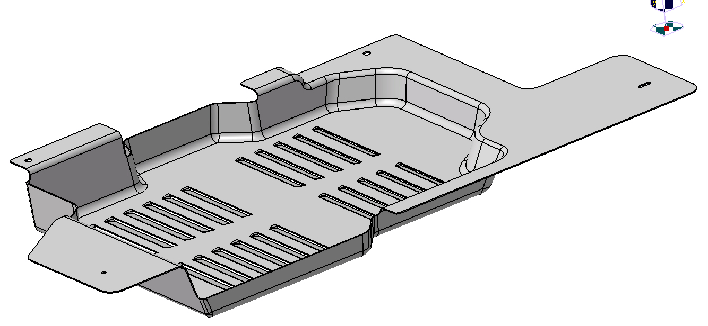

# Projects - Designs CAD :nut_and_bolt:
:round_pushpin:**Some Projects and designs worked with CADs Software (Catia , AutoCad, SolidWorks) as Freelancer and with Companies.** 

:exclamation: For more information or details of each project, please contact me! nico.marquez@hotmail.com :email:
 
 Below , you can find some images and then in each folder you can find the files:

**1) As freelancer with Lasso S.A company, I designed the following parts:**

Concrete mixer:

Lawn mower part:

**2) As a Product Engineer at Renault Argentina I designed and applied the following parts for one project which I was also the Project Manager.**

Metal fairing part bracket & PROTECTEUR MODULE ALIMENTATION UREEA- Renautl Master project:

**3) As a freelancer I was hired by a group of Mechanical Engineers to design and calculate a retractable tribune to apply it in real life. 
 The difference between the Gabriel and Emanuel rostrum was an automated scissor system.**

Retractable tribune:

**4) As a freelancer I am working with a plastic recycling machinery company. We are in the process of designing a machine to make plastic sleepers.**

Project:

**5) As a freelancer I worked with the Balancor company and developed an electronic scale for field grains.**

This was a machine with a hopper and built-in load cells to fill bags of corn kernels with an exact weight:

#***Thanks for visiting my portfolio!*** :wave:
